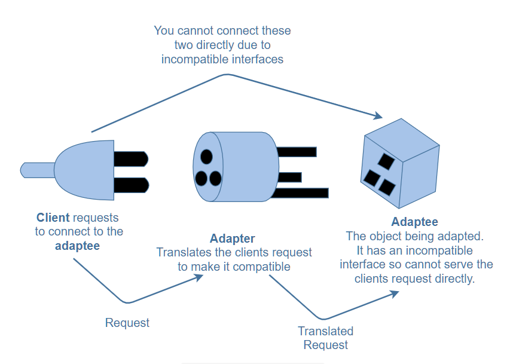
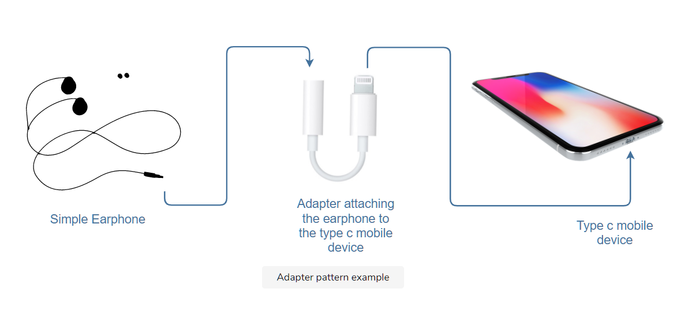

# What is the adapter pattern?

The adapter pattern allows classes that have different interfaces (properties/methods of an object) to work together.
It translates the interface for a class to make it compatible with another class.

This pattern is useful if an API is modified or new implementations are added to it.
In this case, if the other parts of a system are still using the old API, the adapter pattern will translate the interface so that the two can work together.



As you can see from the diagram above, the client cannot connect to the adaptee directly as the two interfaces are incompatible. This is where the adapter comes in. It translates the client’s calls to its interface and redirects them into calls to the adaptee (original interface).

# Example

```javascript
class SimpleEarphones {
  constructor() {
    this.attach = function () {
      console.log("Use Earphones with Type C phone");
    };
  }
}

class EarPhoneAdapter extends SimpleEarphones {
  constructor(typeCphone) {
    super();
    this.attach = function () {
      typeCphone.attach();
    };
  }
}

class TypeCPhone {
  constructor() {
    this.attach = function () {
      console.log("Earphones attached to Type C phone");
    };
  }
}

var typeCphone = new TypeCPhone();
var adapter = new EarPhoneAdapter(typeCphone);
adapter.attach();
```

# Explanation

The diagram below illustrates the working of the adapter to attach the earphones to the mobile phone.


In the code above, we want to attach a simple earphone to a type c mobile device. We have a SimpleEarphones class which has a method, attach, defined on it like so:

```javascript
class SimpleEarphones {
  constructor() {
    this.attach = function () {
      console.log("Use Earphones with Type C phone");
    };
  }
}
```

Similarly, we have a TypeCPhone class that also has the attach method defined on it like this:

```javascript
class TypeCPhone {
  constructor() {
    this.attach = function () {
      console.log("Earphones attached to Type C phone");
    };
  }
}
```

You can’t insert a simple earphone into a type c phone directly, hence, you need an adapter that allows you to connect your earphone to the mobile phone. For this purpose, we have an EarPhoneAdapter class that inherits from the SimpleEarphones class.

```javascript
class EarPhoneAdapter extends SimpleEarphones {
  constructor(typeCphone) {
    super();
    //code...
  }
}
```

The super command initializes the constructor of the SimpleEarphones class.

```javascript
class SimpleEarphones {
  constructor() {
    this.attach = function () {
      console.log("Use Earphones with Type C phone");
    };
  }
}

class EarPhoneAdapter extends SimpleEarphones {
  constructor(typeCphone) {
    //super initializing "SimpleEarphones" constructor
    super();
  }
}

class TypeCPhone {
  constructor() {
    this.attach = function () {
      console.log("Earphones attached to Type C phone");
    };
  }
}

var typeCphone = new TypeCPhone();
var adapter = new EarPhoneAdapter(typeCphone);
// Since super initialized "SimpleEarphones" constructor
// its `attach` method will get initialized
// So the command below will display the result from the "SimpleEarphones" attach function
adapter.attach();
```

In our case, we redefine the attach function in the EarPhoneAdapter class as follows:

```javascript
class EarPhoneAdapter extends SimpleEarphones {
  constructor(typeCphone) {
    super();
    this.attach = function () {
      typeCphone.attach();
    };
  }
}
```

Now, the TypeCPhone's attach function is called instead. Hence, the adapter class implements SimpleEarphones and attaches it to the TypeCPhone through the EarPhoneAdapter constructor.

# When to use the adapter pattern?

The adapter pattern is used when we need old APIs to work with new refactored ones or when an object needs to cooperate with a class that has an incompatible interface. It can also be used to reuse the existing functionality of classes.
