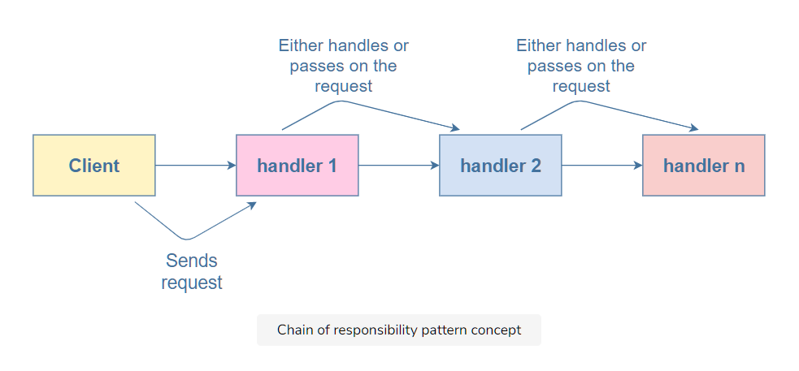

# What is the chain of responsibility pattern?

The chain of responsibility pattern allows a request sent by a client to be received by more than one object. It creates a chain of loosely-coupled objects that, upon receiving the request, either handle it or pass it to the next handler object.

A common example of this pattern is event bubbling in DOM. An event propagates through different nested elements of the DOM until one of them handles it.



# Example

```javascript
class HandlerChain {
  setNextObj(nextObjInChain) {}
  processMultiple(req) {
    console.log("No multiple for: " + req.getMultiple());
  }
}

class Multiple {
  constructor(multiple) {
    this.multiple = multiple;
  }

  getMultiple() {
    return this.multiple;
  }
}

class MultipleofTwoHandler extends HandlerChain {
  constructor() {
    super();
    this.nextObjInChain = new HandlerChain();
  }

  setNextObj(nextObj) {
    this.nextObjInChain = nextObj;
  }

  processMultiple(req) {
    if (req.getMultiple() % 2 == 0) {
      console.log("Multiple of 2: " + req.getMultiple());
    } else {
      this.nextObjInChain.processMultiple(req);
    }
  }
}

class MultipleofThreeHandler extends HandlerChain {
  constructor() {
    super();
    this.nextObjInChain = new HandlerChain();
  }

  setNextObj(nextObj) {
    this.nextObjInChain = nextObj;
  }

  processMultiple(req) {
    if (req.getMultiple() % 3 == 0) {
      console.log("Multiple of 3: " + req.getMultiple());
    } else {
      this.nextObjInChain.processMultiple(req);
    }
  }
}

class MultipleofFiveHandler extends HandlerChain {
  constructor() {
    super();
    this.nextObjInChain = new HandlerChain();
  }

  setNextObj(nextObj) {
    this.nextObjInChain = nextObj;
  }

  processMultiple(req) {
    if (req.getMultiple() % 5 == 0) {
      console.log("Multiple of 5: " + req.getMultiple());
    } else {
      this.nextObjInChain.processMultiple(req);
    }
  }
}

//configuring the chain of handler objects
var c1 = new MultipleofTwoHandler();
var c2 = new MultipleofThreeHandler();
var c3 = new MultipleofFiveHandler();
c1.setNextObj(c2);
c2.setNextObj(c3);

//the chain handling different cases
c1.processMultiple(new Multiple(95));
c1.processMultiple(new Multiple(50));
c1.processMultiple(new Multiple(9));
c1.processMultiple(new Multiple(4));
c1.processMultiple(new Multiple(21));
c1.processMultiple(new Multiple(23));
```

# Explanation

The example above implements the chain of responsibility pattern to check if a given number is a multiple of two, three, or five.

> This example is for positive multiples only.

So, how do we want to implement this functionality? We want to give a number and let the handlers in the chain decide if they’re going to process it or pass it to the next.

We have three types of handlers in the chain:

- MultipleofTwoHandler: checks if the number is a multiple of two

- MultipleofThreeHandler: checks if the number is a multiple of three

- MultipleofFiveHandler: checks if the number is a multiple of five

The first step is to create a chain of the three handlers above. We have the HandlerChain class for this purpose and it contains two functions: setNextObj and processMultiple.

```javascript
class HandlerChain {
  setNextObj(nextObjInChain) {}
  processMultiple(req) {
    console.log("No multiple for: " + req.getMultiple());
  }
}
```

The default implementation of processMultiple is when there is no multiple for a number.

All the handlers in the chain inherit from this class. Therefore, each handler can perform two operations: set the next handler object in the chain and process the number to see if it is its multiple.

```javascript
class MultipleofTwoHandler extends HandlerChain {
  constructor() {
    /*code*/
  }
  setNextObj(nextObj) {
    /*code*/
  }
  processMultiple(req) {
    /*code*/
  }
}

class MultipleofThreeHandler extends HandlerChain {
  constructor() {
    /*code*/
  }
  setNextObj(nextObj) {
    /*code*/
  }
  processMultiple(req) {
    /*code*/
  }
}

class MultipleofFiveHandler extends HandlerChain {
  constructor() {
    /*code*/
  }
  setNextObj(nextObj) {
    /*code*/
  }
  processMultiple(req) {
    /*code*/
  }
}
```

The constructor for each handler is defined as follows:

```javascript
constructor(){
    super()
    this.nextObjInChain = new HandlerChain()
}
```

super initializes the methods: setNextObj and processMultiple of the parent class for the handler classes. The constructor also initializes the variable nextObjInChain, which will be the object next to the current one in the chain.

So, how does the current object set the next object in the chain? Let’s look at the setNextObj function for that. Here’s how it is defined in each handler:

```javascript
setNextObj(nextObj){
    this.nextObjInChain = nextObj;
}
```

It sets the next object in the chain equal to the object passed as a parameter to the function. So now, we can create a chain of handlers as follows:

```javascript
var c1 = new MultipleofTwoHandler();
var c2 = new MultipleofThreeHandler();
var c3 = new MultipleofFiveHandler();
c1.setNextObj(c2);
c2.setNextObj(c3);
```

We create the handlers c1, c2, and c3 for processing the multiples of two, three, and five. They are connected in the following manner: c2 is next to c1 and c3 is next to c2.


Now that the chain has been created, it is time to process the multiple given. Let’s start by creating a “multiple” object using the Multiple class like so:

```javascript
class Multiple {
  constructor(multiple) {
    this.multiple = multiple;
  }

  getMultiple() {
    return this.multiple;
  }
}
```

A Multiple object consists of the multiple property, that is, the number and a getMultiple function that returns the multiple.

Each handler can choose to process the multiple using the processMultiple function. Here’s how it is defined for the MultipleofTwoHandler:

```javascript
processMultiple(req) {
    if ((req.getMultiple() % 2) == 0) {
      console.log("Multiple of 2: " + req.getMultiple());
    }else{
      this.nextObjInChain.processMultiple(req);
    }
}
```

It takes a multiple and checks if its mod (%) with 2 is 0. If so, it displays that the number passed is a multiple of 2. If the number is not a multiple of 2, the handler passes it to the next object in the chain and the same process repeats. This goes on until one of the handlers returns an answer.

The definition of the processMultiple function is the same for all three handlers. MultipleofThreeHandler takes the mod with 3, and MultipleofFiveHandler takes the mod with 5.

Let’s take an example and see what happens:

```javascript
c1.processMultiple(new Multiple(95));
```

The first handler in the chain, c1, takes the multiple 95 and checks if it is a multiple of 2. The answer is false, so it passes it on to the second handler in the chain, that is, the multiple of three handler. The answer is false again, so it passes it on to the third handler in the chain, the multiple of five handler. It returns the answer because 95 is a multiple of five.


# When to use the chain of responsibility pattern?

You can use it if your program is written to handle various requests in different ways without knowing the sequence and type of requests beforehand. It allows you to chain several handlers, thus, allowing all of them a chance to process the request.

A good example of the use of the chain of responsibility pattern is in the process of event bubbling in the DOM, where the event propagates through the nested elements, one of which may choose to handle the event.
