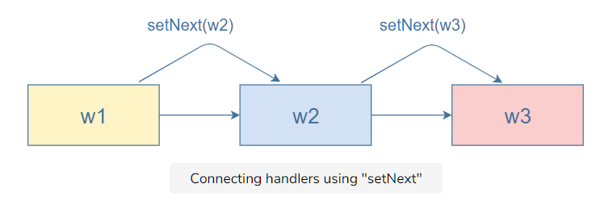
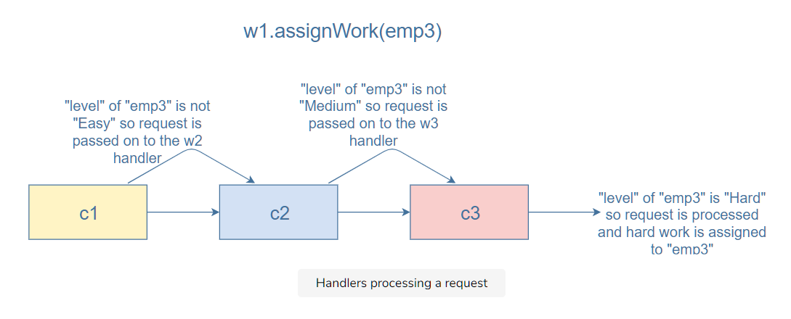

# Explanation:

In this challenge, you had to use the chain of responsibility pattern to assign work to employees.
We start by creating an employee. Here’s what the Employee class looks like:

```javascript
class Employee {
  constructor(name, level) {
    this.name = name;
    this.level = level;
  }

  getLevel() {
    return this.level;
  }

  getName() {
    return this.name;
  }
}
```

An employee will have a name and a level.
Every employee can have one of the three levels: easy, medium, or hard.
The level of an employee denotes the level of tasks that they can handle.
So, an employee with an easy level can only handle easy tasks and the same goes for employees with medium and hard levels.
The getLevel and getName functions return the name and level property of an employee.
Now that we have an employee, the next task is to assign work to that employee.
For this purpose, we define the following three classes:

```javascript
class EasyLevelWorkHandler extends EmployeeChain {
  //code...
}

class MediumLevelWorkHandler extends EmployeeChain {
  //code...
}

class HardLevelWorkHandler extends EmployeeChain {
  //code...
}
```

The three classes above decide if an employee should be assigned the easy, medium, or hard work.
We want to put them in a chain so that the request to assign work to an employee can be handled by either one of them.
All three of them inherit from the EmployeeChain parent class.

```javascript
class EmployeeChain {
  setNext(nextInChain) {}
  assignWork(req) {}
}
```

The constructor for all three classes is defined as follows:

```javascript
constructor() {
  super()
  this.nextInChain = new EmployeeChain()
}
```

super initializes the parent methods for the child class.
The constructor also initializes the variable nextInChain, which will be the object next to the current one in the chain.
The next step is to create a chain of handlers.
For this purpose, we define the setNext function in each child class as follows:

```javascript
setNext(nextObj){
  this.nextInChain = nextObj;
}
```

It sets the next object in the chain equal to the object passed as a parameter to the function.
So now, we can create a chain of handlers as follows:

```javascript
var w1 = new EasyLevelWorkHandler();
var w2 = new MediumLevelWorkHandler();
var w3 = new HardLevelWorkHandler();
w1.setNext(w2);
w2.setNext(w3);
```

We create the handlers w1, w2, and w3. They are connected in the following manner:


Now, if a request is sent to assign some work to an employee, w1 (EasyLevelWorkHandler) will check if the level of that employee is Easy. If it is, it will assign easy work to the employee. Else, it will forward the request to the next handler in the chain. We write the code for this in the assignWork function:

```javascript
assignWork(req) {
  if (req.getLevel() == "Easy") {
   console.log("Easy work assigned to: " + req.getName());
    }else{
      this.nextInChain.assignWork(req);
    }
}
```

assignWork has the same definition in the medium and hard level handlers. MediumLevelWorkHandler checks if the level of the employee is Medium. If not, it forwards the request to the next handler, HardLevelWorkHandler, which checks if the level of the employee is Hard and assigns the work accordingly.

Let’s look at an example now:

```javascript
const emp3 = new Employee("Shawn", "Hard");
w1.assignWork(emp3);
```

The work needs to be assigned to emp3. The first handler in the chain, EasyLevelWorkHandler, will check if the level of emp3 is Easy. The answer will be false, so it’ll forward the request to assign work to the next handler in the chain, MediumLevelWorkHandler, which will check if the level of emp3 is Medium. The answer will be false, so it’ll forward the request to assign work to the next handler in the chain, HardLevelWorkHandler. This handler will check if the level of emp3 is Hard. The answer will be true, so it’ll return a message that hard work has been assigned to Shawn.
