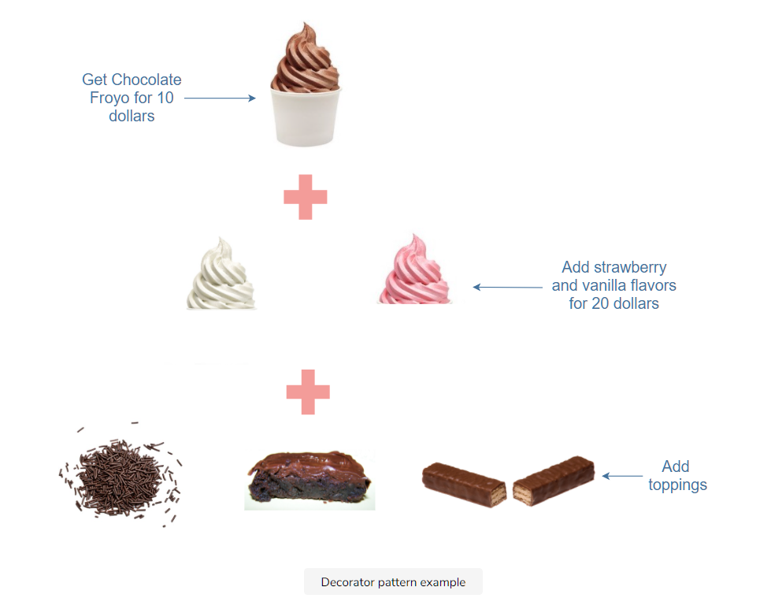

# What is the decorator pattern?

The decorator pattern focuses on adding properties, functionalities, and behavior to existing classes dynamically.
The additional decoration functionalities aren’t considered essential enough to be a part of the original class definition as they can cause clutter.
Hence, the decorator pattern lets you modify the code without changing the original class.
Unlike the creational patterns, the decorator pattern is a structural pattern that does not focus on object creation rather decoration.
Hence, it doesn’t rely on prototypal inheritance alone; it takes the object and keeps adding decoration to it.
This makes the process more streamlined. Let’s take a look at an example to understand this concept better.

# Example

```javascript
class FrozenYoghurt {
  constructor(flavor, price) {
    this.flavor = flavor;
    this.price = price;
  }

  orderPlaced() {
    console.log(
      `The ${this.flavor} flavor will cost you ${this.price} dollars`
    );
  }
}

// decorator 1
function addFlavors(froyo) {
  froyo.addStrawberry = true;
  froyo.addVanilla = true;
  froyo.price += 20;
  froyo.updatedInfo = function () {
    console.log(
      `The updated price after adding flavors is ${froyo.price} dollars`
    );
  };
  return froyo;
}

// decorator 2
function addToppings(froyo) {
  froyo.hasSprinkles = true;
  froyo.hasBrownie = true;
  froyo.hasWafers = true;
  froyo.allToppings = function () {
    console.log("Your froyo has sprinkles, brownie, and wafers");
  };
  return froyo;
}

//using decorators
//creating a froyo
const froyo = new FrozenYoghurt("chocolate", 10);
froyo.orderPlaced();
//adding flavors
var froyowithFlavors = addFlavors(froyo);
froyowithFlavors.updatedInfo();
//adding toppings
var froyoWithToppings = addToppings(froyo);
froyoWithToppings.allToppings();
```


# When to use the decorator pattern?
JavaScript developers can use the decorator pattern when they want to easily modify or extend the functionality of an object without changing its base code.
It can also be used if an application has a lot of distinct objects with the same underlying code. 
Instead of creating all of them using different subclasses, additional functionalities can be added to the objects using the decorator pattern.
A simple example is text formatting, where you need to apply different formattings such as bold, italics, and underline to the same text.