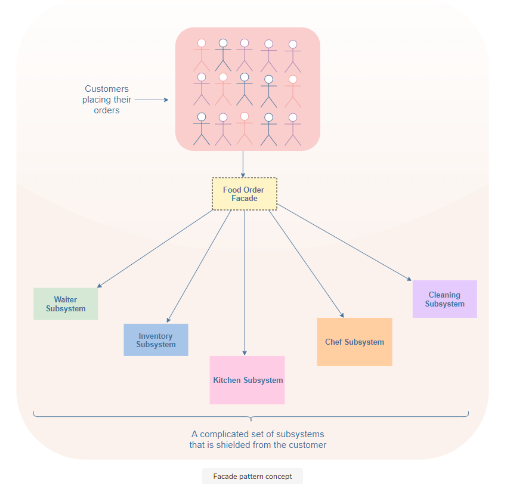
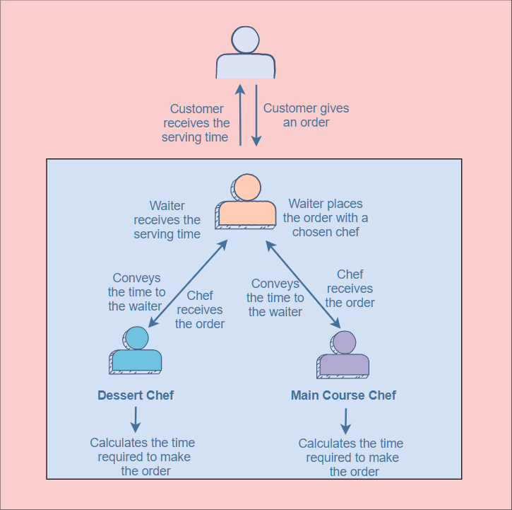

# What is the facade pattern?

In English, the word facade means a deceptive front or appearance.
Following this definition, a facade pattern provides a simpler interface that hides the complex functionalities of a system.
This is widely used in JavaScript libraries like jQuery.
The facade pattern allows you to hide all the messy logic from the client and only display the clear and easy-to-use interface to them.
This allows them to interact with an API easily in a less error-prone way and without accessing the inner workings directly.


# Example

```javascript
let orderNumber = 0;

class PlaceFoodOrder {
  placeOrder(orderDetails) {
    const orderId = PlaceFoodOrder.generateId();
    let chef;
    if (orderDetails.foodType === "Main Course") {
      chef = new MainCourseChef();
    } else if (orderDetails.foodType == "Dessert") {
      chef = new DessertChef();
    }
    return chef.addFoodOrder({ orderId, orderDetails });
  }
  static generateId() {
    return ++orderNumber;
  }
}

class FoodOrders {
  constructor() {
    this.orders = [];
  }
  addFoodOrder(order) {
    this.orders.push(order);
    return this.conveyOrder(order);
  }
  timetoMakeOrder() {}
  conveyOrder(order) {}
}

class MainCourseChef extends FoodOrders {
  constructor() {
    super();
    this.assigned = true;
    return this;
  }
  timetoMakeOrder() {
    return Math.floor(Math.random() * 50) + 10;
  }
  conveyOrder({ orderId, orderDetails }) {
    const time = this.timetoMakeOrder();
    console.log(
      `Order number ${orderId}: ${orderDetails.foodDetails} will be served in ${time} minutes.`
    );
  }
}

class DessertChef extends FoodOrders {
  constructor() {
    super();
    this.assigned = true;
    return this;
  }
  timetoMakeOrder() {
    return Math.floor(Math.random() * 30) + 10;
  }
  conveyOrder({ orderId, orderDetails }) {
    const time = this.timetoMakeOrder();
    console.log(
      `Order number ${orderId}: ${orderDetails.foodDetails} will be served in ${time} minutes.`
    );
  }
}

const customer = new PlaceFoodOrder();
const order1 = customer.placeOrder({
  foodType: "Main Course",
  foodDetails: "Pasta with Shrimps",
});
const order2 = customer.placeOrder({
  foodType: "Dessert",
  foodDetails: "Molten Lava Cake",
});
```

# Explanation

The coding example above uses the facade pattern to implement a part of the food ordering system in a restaurant.

Let’s start from step one, when the waiter takes the order from the customer. The customer informs the waiter about the type of food they want: the main course, a dessert, or both. The waiter notes it down and places the customer’s orders.

```javascript
const customer = new PlaceFoodOrder();
const order1 = customer.placeOrder({
  foodType: "Main Course",
  foodDetails: "Pasta with Shrimps",
});
const order2 = customer.placeOrder({
  foodType: "Dessert",
  foodDetails: "Molten Lava Cake",
});
```

After placing the orders, the waiter conveys to the customer how long it will take for the meal to be ready. This is the output you see on the console if you run the code above.

For the customer, the process is simple: just place an order and receive the approximate time for getting served. However, there is a lot that happens in the background from the moment the order is placed. Let’s take a look.

The line customer.placeOrder invokes the placeOrder method defined in the PlaceFoodOrder class. Let’s see what it does:

```javascript
//placing an order for a shrimp pasta in the main course
customer.placeOrder({foodType: "Main Course", foodDetails: "Pasta with Shrimps"});

placeOrder(orderDetails) {
    const orderId = PlaceFoodOrder.generateId();
    //code....
}
```

The first step is to generate an orderId for the order placed using the generateId() method.

```javascript
static generateId() {
    return ++orderNumber;
}
```

generateId increments the orderNumber (initially set to 0) whenever a new order is placed and returns it.

Once the orderId is assigned, it is time to choose a chef to prepare the order.

```javascript
placeOrder(orderDetails){
  //code....
    if (orderDetails.foodType === 'Main Course') {
      chef = new MainCourseChef();
    } else if (orderDetails.foodType === 'Dessert') {
      chef = new DessertChef();
    }
  //code....
```

If the customer ordered a Main Course, the chef chosen is the MainCourseChef. On the other hand, if the customer ordered a Dessert, the chef chosen is the DessertChef.

Once the chef has been chosen, the last step is to convey the order to them, so they know what to cook.

```javascript
placeOrder(orderDetails){
  //code....
  return chef.addFoodOrder({ orderId, orderDetails });
}
```

Here, we are using the addFoodOrder method. It is defined inside another class, FoodOrders.

```javascript
class FoodOrders {
  addFoodOrder(order) {}
  timetoMakeOrder() {}
  conveyOrder(order) {}
}
```

This class contains all the methods/properties related to orders such as: addFoodOrder, timetoMakeOrder, and conveyOrder.

Let’s look at the addFoodOrder method first:

```javascript
addFoodOrder(order) {
    this.orders.push(order);
    return this.conveyOrder(order);
}
```

This method takes an order placed by a customer and adds it to the list of orders. This list is initialized in the constructor of the FoodOrders class. Next, it calls and returns the result from the conveyOrder method.

For a chef to start preparing a meal, he needs to receive an order first. After that, the chef will decide how long it will take to make the meal. Once the chef has figured out the time, it will be conveyed to the waiter or the cashier so they can inform the customer.

Each chef decides the time using the timetoMakeOrder method and conveys this time to the waiter using the conveyOrder method. Since both of these methods are related to the food orders placed, they are declared in the FoodOrders class. The chef classes: MainCourseChef and DessertChef inherit these methods and define them accordingly.

```javascript
class MainCourseChef extends FoodOrders{
  timetoMakeOrder(){
  return Math.floor(Math.random() * 50) + 10
}

conveyOrder({orderId,orderDetails}) {
   const time = this.timetoMakeOrder()
    console.log( `Order number ${orderId}: ${orderDetails.foodDetails} will be served in ${time} minutes.`);
}

class DessertChef extends FoodOrders{
timetoMakeOrder(){
    return Math.floor(Math.random() * 30) + 10
}
conveyOrder({orderId,orderDetails}) {
   const time = this.timetoMakeOrder()
    console.log( `Order number ${orderId}: ${orderDetails.foodDetails} will be served in ${time} minutes.`);
}
```

Both chefs take different times to make dishes. The MainCourseChef can take between 10~60 minutes to prepare a meal and the DessertChef can take between 10~30 minutes to prepare a dish. The conveyOrder function displays this time, which the waiter then conveys to the customer.

From this example, you can see the benefit of the facade pattern. It hid the complex parts such as generating an order id, assigning a chef, or deciding the meal preparation time from the customer.



# When to use the facade pattern?

The facade pattern is used to simplify a client’s interaction with a system. So, it can be used when an application has a large and complex underlying code that the client does not need to see.

It can also be used when you want to interact with the methods present in a library without knowing the processing that happens in the background. An example can be of the JavaScript libraries such as jQuery.
