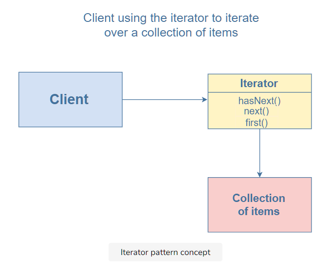

# What is the iterator pattern?

The iterator pattern allows the definition of various types of iterators that can be used to iterate a collection of objects sequentially without exposing the underlying form.

Iterators encapsulate how the traversal occurs in an iteration. Most languages have built-in iterators such as IEnumerable and IEnumerator. However, JavaScript only supports basic looping constructs like for loop, for-in loop, while loop etc. The iterator pattern allows JavaScript developers to build other complex iterators which can be used to easily traverse collections that are stored in something complex such as graphs or trees. These iterators can then be used by the client to traverse a collection without having to know their inner workings.

Iterators follow the behavior where they call a next function and step through a set of values until they reach the end. To do this, they need to maintain a reference to the current position as well as the collection they are traversing. Hence, an iterator has functions such as next, hasNext, currentItem, and each.



# Example

```javascript
class Iterator {
  constructor(elements) {
    this.index = 0;
    this.elements = elements;
  }
  next() {
    return this.elements[this.index++];
  }
  hasNextElement() {
    return this.index <= this.elements.length;
  }
  first() {
    this.index = 0;
    return this.next();
  }
}

function iterate() {
  var items = ["Yellow", "Green", "Blue"];
  var iter = new Iterator(items);
  for (var i = iter.first(); iter.hasNextElement(); i = iter.next()) {
    console.log(i);
  }
}

iterate();
```

# Explanation

In the code above, we created an Iterator class that initializes the following properties:
index: to keep track of the elements in the collection
elements: the data to traverse

```javascript
class Iterator {
  constructor(elements) {
    this.index = 0;
    this.elements = elements;
  }
  //code...
}
```

As discussed, an iterator is used to traverse a collection. Hence, it should consist of methods such as:

- next: to move to the next element in the collection

```javascript
next(){
  return this.elements[this.index++];
}
```

- hasNextElement: to check if the next element exists in the collection

```javascript
hasNextElement() {
  return this.index <= this.elements.length;
}
```

- first: to move to the first element of the collection

```javascript
first(){
  this.index = 0;
  return this.next()
}
```

Finally, to use this iterator, we implement the iterate function like so:

```javascript
function iterate() {
  var items = ["Yellow", "Green", "Blue"];
  var iter = new Iterator(items);
  for (var i = iter.first(); iter.hasNextElement(); i = iter.next()) {
    console.log(i);
  }
}
```

We make an array called items and pass it to the Iterator. Next, we implement a for loop that uses the .first, .hasNextElement, and .next methods to traverse and display the elements one by one.

Just like the for loop, we can also use the each method to traverse the elements of a collection. Let’s look at its implementation below:

```javascript
class Iterator {
  constructor(elements) {
    this.index = 0;
    this.elements = elements;
  }
  next() {
    return this.elements[this.index++];
  }
  hasNextElement() {
    return this.index <= this.elements.length;
  }
  first() {
    this.index = 0;
    return this.next();
  }
  each(func) {
    for (var item = this.first(); this.hasNextElement(); item = this.next()) {
      func(item);
    }
  }
}

function iterate() {
  var items = ["Yellow", "Green", "Blue"];
  var iter = new Iterator(items);
  iter.each(function (item) {
    console.log(item);
  });
}

iterate();
```

As you can see, the each method itself uses the for loop. However, the client will not be able to see that. They’ll call the each method directly without knowing its underlying implementation.

each takes a function func. It then uses the for loop and the .next, .hasNext, and .first methods to traverse the elements. For each element, it invokes the func function.

# When to use the iterator pattern?

This pattern can be used when dealing with problems explicitly related to iteration, for designing flexible looping constructs and accessing elements from a complex collection without knowing the underlying representation. You can use it to implement a generic iterator that traverses any collection independent of its type efficiently.
