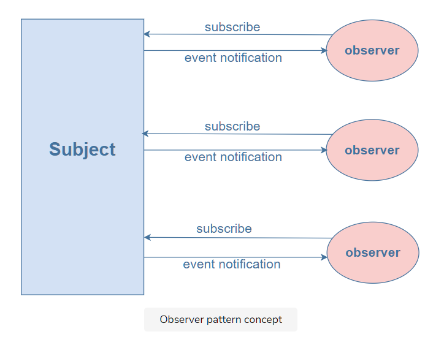

# What is the observer pattern?

The observer pattern is a major behavioral design pattern. It allows objects (observers) that have subscribed to an event to wait for input and react to it when notified. This means they don’t have to continuously keep checking whether the input has been provided or not. The main subject maintains a list of all the observers and whenever the event occurs, it notifies the observers so they can update their states accordingly.

Let’s look at a real-life example that we can map to this pattern. Consider a website that posts interesting articles. Every day, you visit the site to check for new articles and if there is none, you revisit after some time/days. What if you get a subscription to the website instead? Once you have the subscription, you’ll get notified every time a new article is posted. So now, instead of checking the site every few hours, you just wait for the notification about a new article.



# Example

Let’s look at a coding example to understand the implementation of the observer pattern below:

```javascript
class Subject {
  constructor() {
    this.observerList = [];
    this.newArticlePosted = false;
    this.articleName = null;
  }
  subscribe(observer) {
    this.observerList.push(observer);
  }
  unsubscribe(observer) {
    this.observerList = this.observerList.filter((obs) => obs !== observer);
  }
  notify() {
    if (this.newArticlePosted) {
      this.observerList.forEach((subscriber) => subscriber.update());
    } else {
      return;
    }
  }
  getUpdate() {
    return this.articleName;
  }
  postNewArticle(articleName) {
    this.articleName = articleName;
    this.newArticlePosted = true;
    this.notify();
  }
}

class Observer {
  constructor() {
    this.subject = new Subject();
  }
  update() {
    if (subject.getUpdate() == null) {
      console.log("No new article");
    } else {
      console.log(`The new article ${subject.getUpdate()} is posted`);
    }
  }
  setSubject(subject) {
    this.subject = subject;
  }
}
var subject = new Subject();
var observer = new Observer();
observer.setSubject(subject);
subject.subscribe(observer);
observer.update();
subject.postNewArticle("Dark matter");
```

# Explanation

In this example, we have the Subject class that stores the list of all observers and notifies them when a new article gets posted on the website.

```javascript
class Subject {
  constructor() {
    this.observerList = [];
    this.newArticlePosted = false;
    this.articleName = null;
  }
  //code..
}
```

The constructor initializes the list observerList that stores all the observers. It has two other properties: newArticlePosted (boolean variable to check whether a new article has been posted or not) and articleName (the name of the article).

It also defines the subscribe and unsubscribe functions to register or remove an observer from the subscription.

```javascript
subscribe(observer){
  this.observerList.push(observer)
}

unsubscribe(observer){
  this.observerList = this.observerList.filter(obs => obs !== observer)
}
```

It has the getUpdate function that returns the name of the new article posted as well.

```javascript
getUpdate(){
  return this.articleName
}
```

How is the new article posted? It’s done using the postNewArticle function like so:

```javascript
postNewArticle(articleName){
  this.articleName = articleName
  this.newArticlePosted = true
  this.notify()
}
```

When a new article is posted, its name is set, the variable newArticlePosted is set to true, and the observer is notified about it by invoking the notify function.

```javascript
notify(){
  if(this.newArticlePosted){
    this.observerList.forEach(subscriber => subscriber.update())
  }
  else{
    return
  }
}
```

The notify function checks if a new article is posted. If it is, it sends the update to each subscriber in the list. Else, it returns.

The Observer class is defined as follows:

```javascript
class Observer {
  constructor() {
    this.subject = new Subject();
  }
  //codee..
  setSubject(subject) {
    this.subject = subject;
  }
}
```

The constructor initiates an instance of Subject and sets it using setSubject. The function accepts a Subject instance and sets it as the subject for the observer.

The Observer also has the update function.

```javascript
update(){
  if(subject.getUpdate() == null){
    console.log("No new article")
  }else{
    console.log(`The new article ${subject.getUpdate()} is posted`)
  }
}
```

This function is invoked by the Subject to notify the observer about the new article getting posted. Hence, it checks for an update. If a new article is found, it displays the notification for it. Else, it returns No new article.

# When to use the observer pattern?

The observer pattern can be used to:

- To improve code management by breaking down large applications into a system of loosely-coupled objects

- provide greater flexibility by enabling a dynamic relationship between observers and subscribers which is otherwise not possible due to tight coupling

- improve communication between different parts of the application

- create a one-to-many dependency between objects that are loosely coupled
