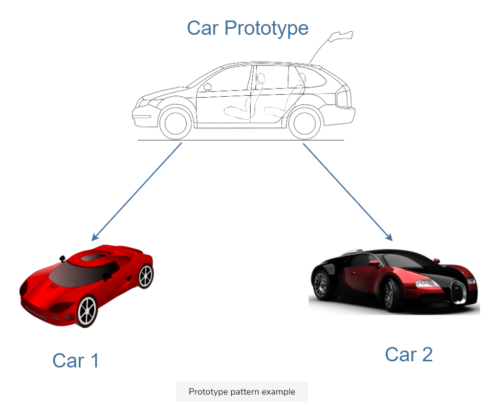

# What is the prototype pattern?

The prototype creational pattern is used to instantiate objects with some default values using an existing object.
It clones the object and provides the existing properties to the cloned object using prototypal inheritance.
In prototypal inheritance, a prototype object acts as a blueprint from which other objects inherit when the constructor instantiates them. Hence, any properties defined on the prototype of a constructor function will also be present in the cloned object it creates.


# Example

```javascript
var car = {
  drive() {
    console.log("Started Driving");
  },
  brake() {
    console.log("Stopping the car");
  },
  numofWheels: 4,
};

const car1 = Object.create(car);
car1.drive();
car1.brake();
console.log(car1.numofWheels);

const car2 = Object.create(car);
car2.drive();
car2.brake();
console.log(car2.numofWheels);
```

# When to use the prototype pattern?
The prototypal pattern has native support in JavaScript. It involves cloning an already-configured object. 
Hence, the cloned objects are created by reference instead of having their own separate copies. This boosts the performance and efficiency of code. 
This pattern can also be used in the following cases:
- To eliminate the overhead of initializing an object
- When you want the system to be independent about how the products in it are created
- When creating objects from a database, whose values are copied to the cloned object