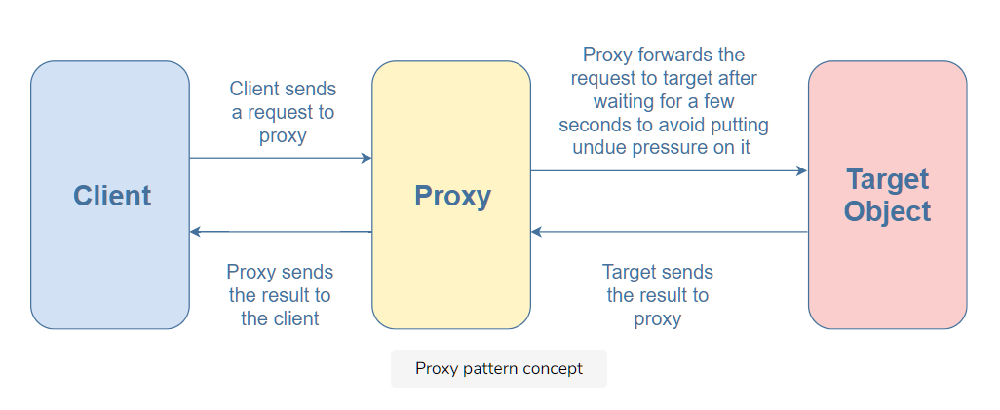
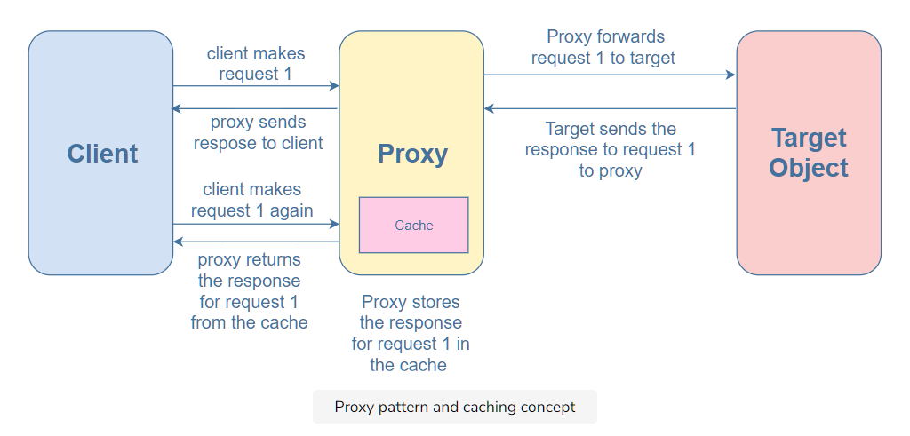

# What is the proxy pattern?

As the name implies, the proxy pattern is a structural pattern that creates a proxy object. It acts as a placeholder for another object, controlling the access to it.

Usually, an object has an interface with several properties/methods that a client can access. However, an object might not be able to deal with the clients’ requests alone due to heavy load or constraints such as dependency on a remote source that might cause delays (e.g., network requests). In these situations, adding a proxy helps in dividing the load with the target object.

The proxy object looks exactly like the target object. A client might not even know that they are accessing the proxy object instead of the target object. The proxy handles the requests from the clients and forwards them to the target object, preventing undue pressure on the target.



The proxy can also act as a cache and store the requests. When the same request is made again, it can just return it from the cache rather than forwarding it to the target. This allows the target to deal with a lesser number of requests.



# Example

```javascript
class GetCapital {
  getMycapital(country) {
    if (country === "Pakistan") {
      return "Islamabad";
    } else if (country === "India") {
      return "New Delhi";
    } else if (country === "Canada") {
      return "Ottawa";
    } else if (country === "Egypt") {
      return "Cairo";
    } else {
      return "";
    }
  }
}

class ProxyGetCapital {
  constructor() {
    this.capital = new GetCapital();
    this.cache = {};
  }

  getMycapital(country) {
    if (!this.cache[country]) {
      var value = this.capital.getMycapital(country);
      this.cache[country] = value;
      return `${value}--Returning From GetCapital`;
    } else {
      return `${this.cache[country]}--Returning from Cache`;
    }
  }
}

var capital = new ProxyGetCapital();
console.log(capital.getMycapital("Pakistan"));
console.log(capital.getMycapital("India"));
console.log(capital.getMycapital("Canada"));
console.log(capital.getMycapital("Egypt"));
console.log(capital.getMycapital("Egypt"));
console.log(capital.getMycapital("Egypt"));
console.log(capital.getMycapital("Pakistan"));
console.log(capital.getMycapital("Pakistan"));
console.log(capital.getMycapital("Canada"));
```

